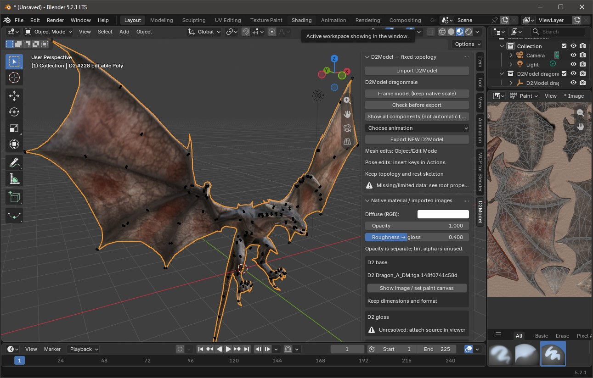
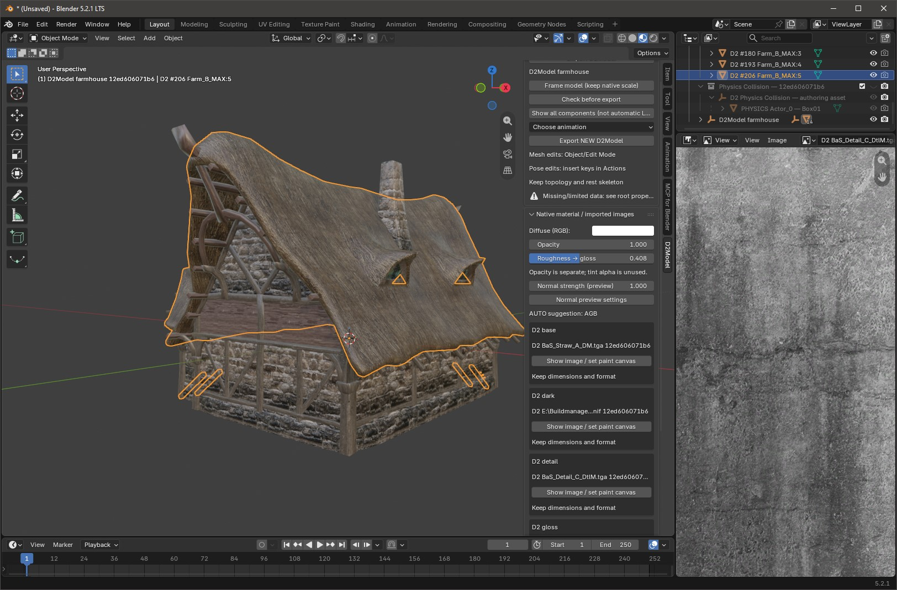

# Divinity II Model Viewer

Explore Divinity II models and prepare them for editing in Blender. Preview
supported NIF, CAT and ITEM assets, inspect textures and animations, and export
visual `.d2model` packages for the modding workflow.

**[Download 0.2.0 for Windows x64](https://github.com/PmNz8/divinity2-model-viewer/releases/tag/v0.2.0)**
 · [Compatibility matrix](COMPATIBILITY_MATRIX.md) · [Limitations](LIMITATIONS.md) · [Changelog](CHANGELOG.md) · [Build from source](BUILD.md)

## What you can do

- Browse resources in the game's `Packed` folder and filter by name or path.
- Preview supported standalone NIF models and models embedded in CAT/ITEM containers.
- Inspect individual components and existing LODs, with manual component selection.
- Preview textures, supported normal maps, skeletons and animation clips.
- Review texture associations and explicitly select missing texture sources.
- Check normalization diagnostics before export.
- Export visual `.d2model` v1/v2 packages and reopen them without the original archive corpus.

The viewer reads game resources without modifying the installation. Exports are
written to new files; Blender editing and patch building are separate steps.

## Quick start

1. Download `Divinity2ModelViewer-0.2.0-windows-x64.zip` from the release page.
2. Extract the **entire folder** and run `Divinity2ModelViewer.exe`.
3. Choose **Open Packed folder** and select the `Data/Win32/Packed` folder in your game installation.
4. Find a supported asset, select it and choose **Use as model**. Review its components, textures and available animations.
5. Check the model diagnostics, then choose **Export source package** and save a new `.d2model` file.

Use **Open package** to inspect an existing visual `.d2model` package instead.

**Requirements:** Windows x64, an OpenGL-capable graphics driver, and your own
game installation for archive browsing. The portable build needs no separate
Python installation. The executable is unsigned.

## Blender and patch workflow

1. **Model Viewer:** select the source asset and export a visual `.d2model` package.
2. **[Blender addon](https://github.com/PmNz8/divinity2-blender-addon):** import the package, make supported geometry, texture or animation edits, and export a new package.
3. **[DKS Patch Builder](https://github.com/PmNz8/divinity2-dks-patch-builder):** import the edited package and build `DKS_Patch.dv2` for testing in the game.

Start from an existing game asset. Supported static ITEM geometry can be
rebuilt within the existing component and material identities; LODs are edited
manually. Skinned models and skeleton edits have additional restrictions.
See [the current limits](LIMITATIONS.md) before starting an edit.

### Blender examples

These screenshots show the companion addon, not the viewer interface.

*Dragon model with the D2Model panel and texture tools.*

*Farmhouse components and material tools. Earlier addon interface; the physics
collection visible in this screenshot is not supported by the current visual-only release.*

## Current limits

- No collision preview, editing, export or cooking. Visual edits do not update game collisions.
- No physics-bearing `.d2model` v3/v4 packages. Export a fresh visual package from the game instead.
- No arbitrary CAT/ITEM creation from scratch or unrestricted skinned topology and skeleton/rest-pose changes.
- No automatic LOD generation, map placement or mod installation.
- Not every asset layout is supported. Unsupported data is rejected rather than silently converted.

Support is experimental and limited to recognized layouts. Read
[LIMITATIONS.md](LIMITATIONS.md) for the full scope.

## Source and bug reports

Each release includes a matching source ZIP and SHA-256 checksums. Build
instructions and pinned dependencies are in [BUILD.md](BUILD.md) and
[requirements.txt](requirements.txt).

[Report an issue](https://github.com/PmNz8/divinity2-model-viewer/issues) with the
viewer version, asset's logical path, exact error message and steps to reproduce.
Do not attach game archives, extracted assets, saves or private data.

## License

The project's own code is licensed under **AGPL-3.0-only**. See [LICENSE](LICENSE)
and [third-party notices](THIRD_PARTY_NOTICES.md) for dependency licenses.

Screenshots illustrate the workflow; the depicted game artwork belongs to its
respective rights holders and is not covered by the project's code license.
This is an unofficial modding tool, not affiliated with or endorsed by the game's developers or publishers.
